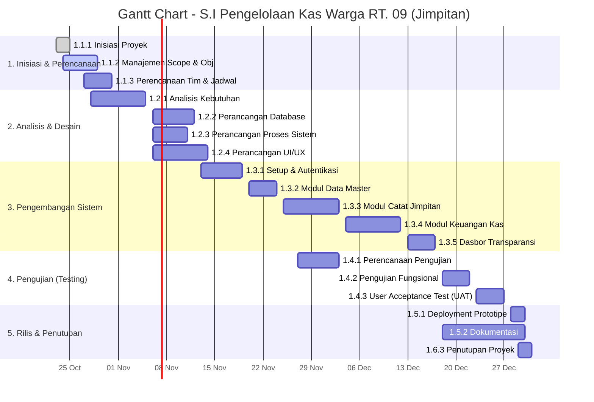

# 📊 Project Roadmap & Gantt Chart

Visualisasi jadwal pelaksanaan proyek **S.I Pengelolaan Kas Warga RT. 09 (Jimpitan)** berdasarkan WBS Level 3.

```mermaid
gantt
    title Gantt Chart - S.I Pengelolaan Kas Warga RT. 09 (Jimpitan)
    dateFormat  YYYY-MM-DD
    axisFormat  %d %b
    
    section 1. Inisiasi & Perencanaan
    1.1.1 Inisiasi Proyek           :done,    task1, 2026-10-23, 2026-10-25
    1.1.2 Manajemen Scope & Obj     :active,  task2, 2026-10-24, 2026-10-29
    1.1.3 Perencanaan Tim & Jadwal  :         task3, 2026-10-27, 2026-10-31
    
    section 2. Analisis & Desain
    1.2.1 Analisis Kebutuhan        :         task4, 2026-10-28, 2026-11-05
    1.2.2 Perancangan Database      :         task5, 2026-11-06, 2026-11-12
    1.2.3 Perancangan Proses Sistem :         task6, 2026-11-06, 2026-11-11
    1.2.4 Perancangan UI/UX         :         task7, 2026-11-06, 2026-11-14
    
    section 3. Pengembangan Sistem
    1.3.1 Setup & Autentikasi       :         task8, 2026-11-13, 2026-11-19
    1.3.2 Modul Data Master         :         task9, 2026-11-20, 2026-11-24
    1.3.3 Modul Catat Jimpitan      :         task10, 2026-11-25, 2026-12-03
    1.3.4 Modul Keuangan Kas        :         task11, 2026-12-04, 2026-12-12
    1.3.5 Dasbor Transparansi       :         task12, 2026-12-13, 2026-12-17
    
    section 4. Pengujian (Testing)
    1.4.1 Perencanaan Pengujian     :         task13, 2026-11-27, 2026-12-03
    1.4.2 Pengujian Fungsional      :         task14, 2026-12-18, 2026-12-22
    1.4.3 User Acceptance Test (UAT):         task15, 2026-12-23, 2026-12-27
    
    section 5. Rilis & Penutupan
    1.5.1 Deployment Prototipe      :         task16, 2026-12-28, 2026-12-30
    1.5.2 Dokumentasi               :         task17, 2026-12-18, 2026-12-30
    1.6.3 Penutupan Proyek          :         task18, 2026-12-29, 2026-12-31
```
